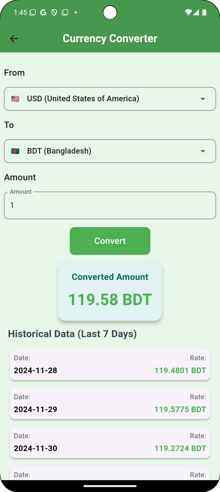
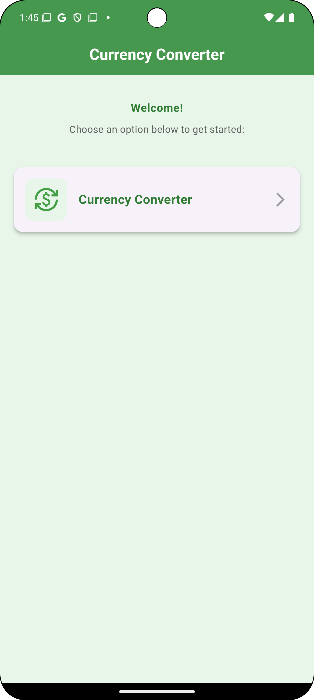

# Currency Converter App

  
  

# Project Overview
This is a Currency Converter app built using Flutter, designed to fetch, cache, and display 
currency exchange rates.The app uses a clean architecture design and integrates local caching 
to enhance performance and usability.Below, you will find instructions on building the project 
and explanations of the design patterns, libraries, and databases used.

## How to Build the Project

## Steps to Build
- Clone the repository:
- git clone <repository-url>
- Navigate to the project directory:
- cd currency_converter
- Get all dependencies:
- flutter pub get
- Run the project:
- flutter run
- Ensure you have an emulator running or a physical device connected.
- To build an APK:
- flutter build apk --release
- The APK will be available in the /build/app/outputs/flutter-apk/ directory.

# Adapted Design Pattern for the App Architecture

## SOLID Principal

Additionally, the project integrates the SOLID principles, which consist of the following:

- Single Responsibility Principle (SRP): Ensures that each class has a single responsibility, enhancing code clarity and maintainability.
- Open/Closed Principle (OCP): Allows for extending the functionality without modifying existing code, promoting code reuse and scalability.
- Liskov Substitution Principle (LSP): Ensures that derived classes can be substituted for their base classes without affecting the correctness of the program.
- Interface Segregation Principle (ISP): Encourages the creation of focused interfaces to prevent clients from depending on unnecessary functionalities.
- Dependency Inversion Principle (DIP): Promotes loose coupling by depending on abstractions, facilitating flexibility and testability.
  By adhering to the SOLID principles, the project achieves code that is modular, reusable, and easier to understand and maintain.
## Clean Architecture
The app is built using the Clean Architecture pattern, which ensures separation of concerns by 
dividing the app into the following layers:

## Data Layer:
Handles data sources (e.g., remote APIs, local databases).
## Domain Layer:
Contains business logic and interacts with repositories.
## Presentation Layer:
Includes UI components (widgets) and state management.

## Benefits of using clean architecture
- Testability: Each layer is independent, making the app easier to test.
- Scalability: Well-organized architecture ensures the app can grow without becoming complex.
  Separation of Concerns: Clear boundaries between UI, business logic, and data handling.
- Reusability: Business logic and data sources can be reused across different parts of the app or 
in other apps.

## Additional Architectural Patterns
## Dependency Injection (DI)

The app employs Dependency Injection to manage the creation and sharing of dependencies. 
By using a service locator (e.g., GetIt), dependencies like DatabaseManager, 
CurrencyLocalDataSource, and CurrencyRemoteDataSource are injected where needed.

## Advantages of DI:
- Improved Testability: Dependencies can easily be mocked during testing.
- Centralized Configuration: Dependency management is centralized, simplifying maintenance.

## Singleton Design Pattern
Some components, such as DatabaseManager, follow the Singleton Design Pattern to 
ensure only a single instance exists throughout the app lifecycle.

## Advantages of singleton:
- Resource Efficiency: Prevents multiple instances of the database connection from being created.
- Global Access: Ensures a shared state across the app without redundant instantiations.

# Centralized API Client and Error Handling
The app includes a centralized API client to manage all network interactions and error handling, 
ensuring consistent and robust communication with remote servers.

## Centralized API Client:
The API client encapsulates common configurations such as base URLs, headers, timeouts, 
and serialization.
Example: A single HTTP client handles all requests, ensuring uniform behavior and reducing 
duplication.
# Centralized Error Handling:
Errors from remote APIs or local operations are handled centrally to standardize error 
responses and user feedback.
Example: The Failure class captures errors with a title and message, making it easier to 
display user-friendly error messages in the UI.

# Benefits of Centralization 
- Consistency: Centralized handling ensures that all API calls and errors are managed in the same 
way,reducing potential bugs and discrepancies.
- Reusability: Common configurations and error-handling logic are reused across the app, 
reducing boilerplate code.
- Improved Debugging: By centralizing error reporting, it becomes easier to identify and 
address issues in the app.
- Scalability: As the app grows, centralized management simplifies the addition of 
new endpoints or error cases.

# cached_network_image

This app uses the cached_network_image library to load and display currency flags. 
This library caches images locally to avoid repeated downloads.

## Benefits of using cached_network_image
- Efficient Caching: Automatically stores downloaded images locally to save bandwidth and 
improve loading times.
- Placeholder Support: Displays placeholders while images are being downloaded.
- Performance: Reduces the load on remote servers and enhances the app's performance 
for end-users.
- Fallback Mechanism: Provides fallback images in case of a network error, 
improving the user experience.

# sqflite

The app uses SQLite as the local database, managed with the sqflite plugin, 
for caching exchange rates. 
Timestamps are stored to check the cache validity.

## Benefits of using sqflite
- Lightweight and Fast: SQLite is a lightweight embedded database that works well 
- on mobile devices.
- Structured Data: Ideal for storing structured data (e.g., currency codes, rates, and timestamps).
- Local Persistence: Enables offline access by caching data locally.
- Reliability: Proven stability and support in Flutter projects.

# Future Improvements
## Reusable Widgets
To create modular and reusable UI components to reduce redundancy and improve maintainability.
Examples of Planned Widgets:
- Custom Button: A reusable button widget with consistent styling across the app.
- Currency Tile: A widget to display currency flags, codes, and exchange rates in a unified format.
- Error Display: A widget to show user-friendly error messages consistently throughout the app.
- Common Styles and Themes
To centralize the app’s visual design using a common theme and style system for better 
consistency and maintainability.
